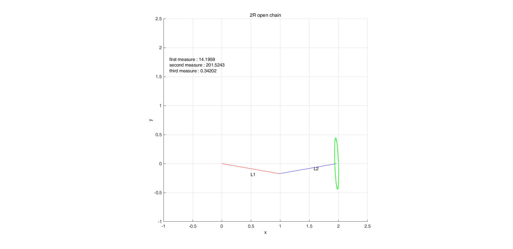
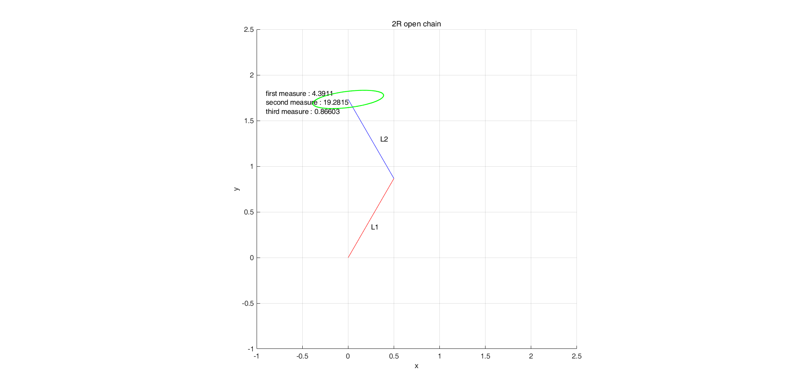
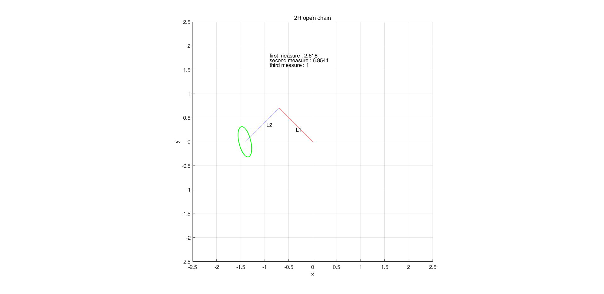
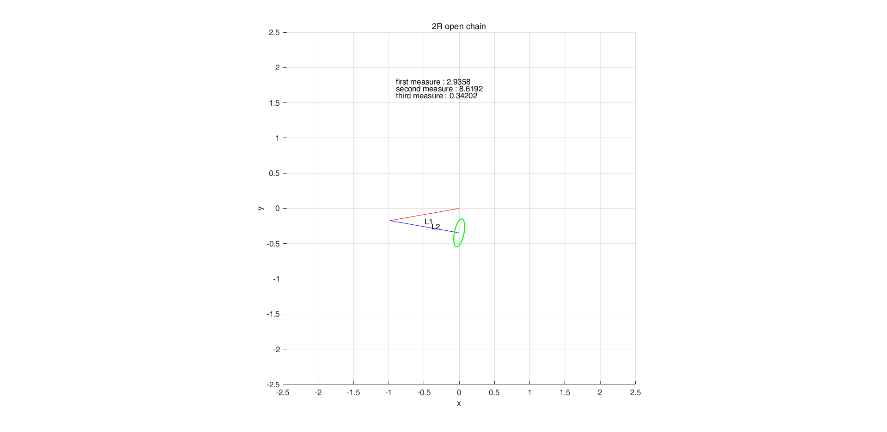
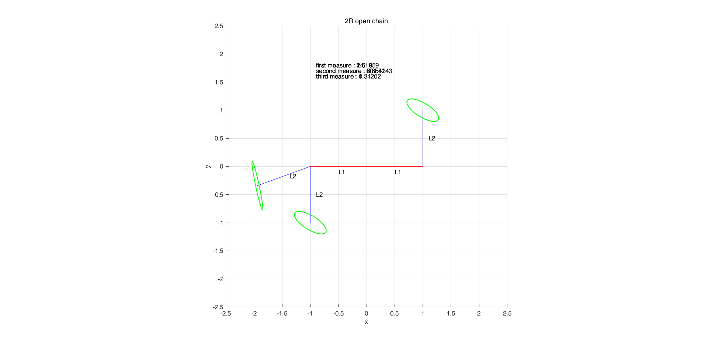

# ME439

homework from ME439

from POSTECH

## contents
1. coppelia sim scene for controlling the Indy 7 manipulator
2. MATLAB assignments for solving problems

### 2R open chain manipulator sim
Using Matlab

Can calculate the 2R open chane robot's configuration with manipulibility elipsoid and 1st, 2nd, 3rd measure of the manipulability.

ex) when L1 = 1, L2 = 1, theta 1 = -10, theta 2 = 10

ex) when L1 = 1, L2 = 1, theta 1 = 60, theta 2 = 60

ex) when L1 = 1, L2 = 1, theta 1 = 135, theta 2 = 90

ex) when L1 = 1, L2 = 1, theta 1 = 190, theta 2 = 160

ex) complex case
